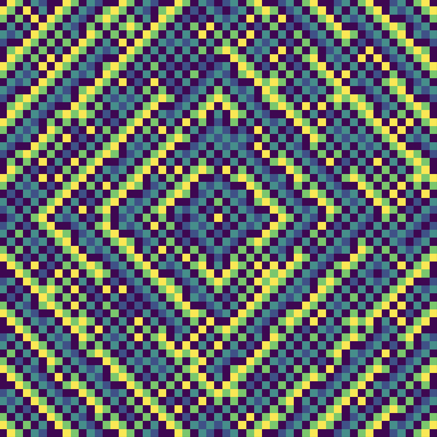
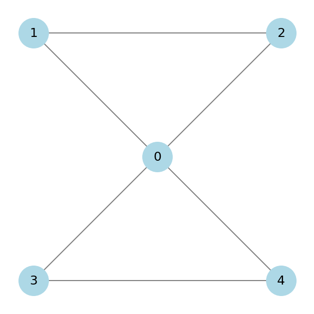

# Random homshift configurations

This project simulates the evolution of a bidimensional array of graph vertices, where each cell can be updated only if it remains compatible (adjacent) with its neighbors in a fixed undirected graph. The simulation is visualized live using a heatmap that updates with each accepted mutation.



## Example Graph

The default graph consists of two triangles sharing a vertex:




```python
G = nx.Graph()
G.add_edges_from([
    (0, 1), (1, 2), (2, 0),       # Triangle 0-1-2-0
    (0, 3), (3, 4), (4, 0)        # Triangle 0-3-4-0
])
```


## How It Works

A square array is initialized with a diamond-shaped pattern. At each iteration, a random interior cell and a random vertex are selected. If the 
this vertex is adjacent (in the graph) to all four direct neighbors (up/down/left/right), the value of the cell is changed to this vertex, abd the heatmap display is updated immediately.

## Install required packages:

```bash
pip install numpy networkx matplotlib
```

## Usage

To run the simulation:

```bash
python main.py
```

This creates the double triangle graph, initializes the array using generate_initial_array, runs simulate() with N=100000 steps, and show a live-updating heatmap of the evolution.

## File Structure

```text 
simulations_homshifts/ 

├── main.py # Main script: simulation loop and visualization 
├── patterns.py # Contains `generate_initial_array`, `mutate_array` 
├── vizualisation.py # Contains `initialize_heatmap`, `update_heatmap` 
├── tests/ 
│ └── test_patterns.py # Unit tests 
└── README.md 
```

## Testing

To run the unit tests:

```bash
pytest tests/
```